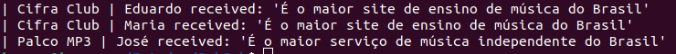
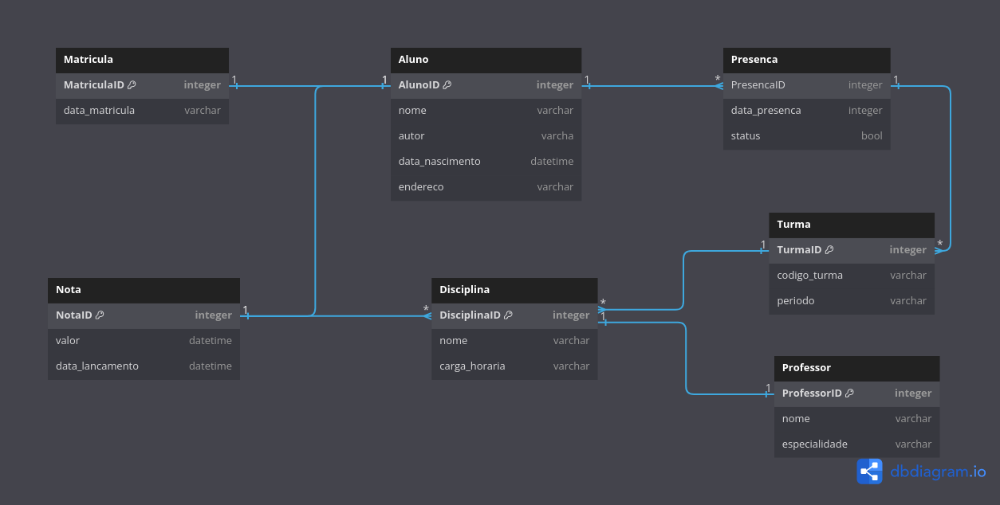

# PubSub #

## QUESTÃO 1: ##

### SOBRE ###
O código do roteamento de mensagens foi desenvolvido utilizando 3 classes, uma servindo como Publisher, na qual envia a mensagem para as pessoas inscritas em seu canal, outra como Subscriber, ou seja, a pessoa que deseja receber as mensagens enviadas pelos Publishers, e tambem a classe Gateway, que serve como um roteamento de mensagens para as respectivas filas. Foi utilizado um arquivo json como banco de dados para salvar as mensagens enviadas por tipo de fila.
Caso fosse permitido o uso de tecnologias externas, utilizaria o redis como fila para processaras requisições e salvar num banco de dados MongoDB.
O projeto foi desenvolvidos sem muitos problemas, e os testes foram criados sem o uso de biblioteca externa.

### COMO RODAR O CÓDIGO ###
```bash
# Fazer o clone do repositório
git clone https://github.com/Igorcand/PubSub.git

# Entrar na pasta
cd PubSub/

# Executar o código
python run.py

```



Ao executar o exemplo, poderá analisar que existem 3 subscribers que receberam as mensagens (Eduardo, Maria e José) enviadas pelos Publishers (Cifra Club e Palco MP3) as respectiavs mensagens 'É o maior site de ensino de música do Brasil' e 'É o maior serviço de música independente do Brasil' 


### COMO RODAR OS TESTES ###
```bash
# Fazer o clone do repositório
git clone https://github.com/Igorcand/PubSub.git

# Entrar na pasta
cd PubSub/

# Rodar os testes de Publisher
python test_publisher.py

# Rodar os testes de Subscriber
python test_subscriber.py

# Rodar os testes de Gateway
python test_gateway.py

```

Ao executar os testes, se todos estiverem corretos, exibirá um print na tela escrito "All gateway tests were successful", caso haja erro, irá mostrar um erro no terminal

OBS: Existem melhores formas de criar testes unitários utilizando a biblioteca Pytest e a UniTest, porém, está na regra do desafio que é proibido utilizar bibliotecas externas.

## QUESTÃO 2: ##

### QUESTÃO 2.1 ###
Cardinalidade:

A cardinalidade em um contexto de índice refere-se à relação entre o número de valores distintos em uma coluna indexada e o número total de registros na tabela. A cardinalidade influencia diretamente a eficiência e o impacto dos índices. Aqui estão alguns pontos relacionados à cardinalidade:

    Alta Cardinalidade:
        Quando uma coluna tem alta cardinalidade, significa que há muitos valores únicos nessa coluna em comparação com o número total de registros. Índices em colunas de alta cardinalidade são geralmente mais eficientes, pois reduzem significativamente o conjunto de dados necessário para uma busca.

    Baixa Cardinalidade:
        Se a cardinalidade for baixa, isso significa que há poucos valores distintos em relação ao número total de registros. Nesse caso, o uso de índices pode não ser tão eficiente, pois o SGBD pode ter que percorrer uma parte substancial da tabela para encontrar os registros desejados.

    Cardinalidade Média:
        Em alguns casos, a cardinalidade pode ser moderada, o que significa que há uma quantidade significativa de valores distintos, mas não tantos a ponto de tornar o índice altamente seletivo. A eficácia do índice dependerá da distribuição dos valores e das consultas executadas.

Expectativa de Redução dos Conjuntos de Dados:

O uso de índices geralmente visa reduzir o conjunto de dados necessário para atender a consultas. A expectativa de redução do conjunto de dados depende de vários fatores, incluindo:

    Tipo de Consulta:
        Consultas que envolvem cláusulas de filtro em colunas indexadas se beneficiarão significativamente. A expectativa é que a busca seja mais eficiente, reduzindo o número de registros a serem examinados.

    Operações de Ordenação e Agrupamento:
        Índices também podem reduzir o custo de operações de ordenação e agrupamento, proporcionando uma expectativa de eficiência nesses casos.

    Operações de Junção:
        Em consultas que envolvem junções entre tabelas, a presença de índices nas colunas de junção pode reduzir significativamente o número de registros que precisam ser combinados.

    Expectativas de Inserção, Atualização e Exclusão:
        Embora os índices melhorem o desempenho de leitura, eles podem aumentar a complexidade e o tempo de operações de inserção, atualização e exclusão. A expectativa nesses casos é que a eficiência de leitura compense o custo adicional nessas operações.

    Tamanho e Distribuição dos Dados:
        A expectativa também depende do tamanho total da tabela e da distribuição dos dados. Em tabelas muito pequenas ou muito grandes, os índices podem ter impactos diferentes.

Em resumo, ao decidir usar índices, é crucial entender a cardinalidade das colunas indexadas, o tipo de consultas realizadas com mais frequência e as expectativas relacionadas à redução do conjunto de dados em operações específicas. O ajuste fino dos índices com base nessas considerações contribui para um desempenho otimizado do banco de dados.

(FAZER UM PARAGRAFO EXPLICANDO O PROBLEMA DE USAR INDICES E A CARDINALIEDADE DAS COLUNAS)
PRECISA DE INDICES NAS COLUNAS: BOOKS, BOOKS_RATING, BOOKS_COMMENTS POR CAUSA DO RELACIONAMENTO DE TABELAS MANY TO MANY COM AS OUTRAS TABELAS
### QUESTÃO 2.2 ###
Para otimizar a consulta fornecida, que busca registros na tabela books onde released_at está entre '2015-01-01 00:00:01' e o momento atual, existem várias medidas que podem ser tomadas para reduzir o subset e agilizar a execução. Aqui estão algumas sugestões:

    Índice em released_at:
        Criar um índice na coluna released_at facilitará a busca por registros que satisfaçam a condição de intervalo. Isso pode significativamente acelerar a consulta, especialmente quando a tabela tem milhões de linhas.

    sql

CREATE INDEX idx_released_at ON books(released_at);

Particionamento da Tabela:

    Se possível, considerar o particionamento da tabela com base na coluna released_at. Isso pode otimizar a busca, permitindo que o banco de dados ignore partições que não contêm dados relevantes para a consulta.

Limitar Colunas Selecionadas:

    Se a tabela possui várias colunas, selecionar apenas as colunas necessárias na consulta pode reduzir a quantidade de dados transferidos e, assim, melhorar o desempenho.

sql

SELECT id, released_at, name
FROM books
WHERE released_at < NOW() AND released_at > '2015-01-01 00:00:01';

Uso de BETWEEN em Vez de Duas Condições Separadas:

    Utilizar a cláusula BETWEEN pode tornar a consulta mais legível e, em alguns casos, otimizar o desempenho.

sql

    SELECT id, released_at, name, author_id, genre_id, publisher_id
    FROM books
    WHERE released_at BETWEEN '2015-01-01 00:00:01' AND NOW();

    Otimização de Configurações do Banco de Dados:
        Verificar e ajustar configurações de banco de dados, como o tamanho do cache, parâmetros de memória e configurações de I/O, pode impactar significativamente o desempenho de consultas.

    Monitoramento e Otimização do Plano de Execução:
        Monitorar o plano de execução da consulta pode fornecer insights sobre como o banco de dados está processando a consulta. Otimizações podem ser aplicadas com base nas informações obtidas.

    Uso de Cache:
        Se a consulta é executada frequentemente, considerar o uso de cache para armazenar resultados de consultas anteriores e evitar a reexecução da consulta quando os mesmos resultados são necessários.

    Revisão de Estatísticas de Tabela:
        Garantir que as estatísticas da tabela estejam atualizadas para permitir ao otimizador de consultas tomar decisões informadas sobre o plano de execução.

Ao implementar essas medidas, é possível melhorar significativamente o desempenho da consulta, especialmente em uma tabela com milhões de linhas. A abordagem exata pode depender das características específicas do banco de dados e do ambiente em que ele está sendo executado.

### QUESTÃO 2.3 ###
Otimizar uma consulta que é usada frequentemente na página inicial da aplicação e que envolve tabelas com milhões de linhas é crucial para garantir um desempenho eficiente. Aqui estão algumas medidas de otimização específicas para o contexto do banco de dados, considerando a query fornecida:

    Índices Adequados:
        Pro: Melhora a velocidade de pesquisa.
        Contra: Pode aumentar o custo de inserção, atualização e exclusão. Pode consumir mais espaço em disco.

    sql

CREATE INDEX idx_book_id ON books_ratings(book_id);
CREATE INDEX idx_books_genre_id ON books(genre_id);
CREATE INDEX idx_genres_id ON genres(id);

Utilizar JOIN Explícito:

    Pro: Melhora a legibilidade e, em alguns casos, o otimizador pode se beneficiar.
    Contra: Em algumas situações, o otimizador pode escolher automaticamente o método mais eficiente, e o JOIN explícito pode não trazer benefícios significativos.

sql

SELECT br.book_id as book
FROM books_ratings br
JOIN books b ON br.book_id = b.id
JOIN genres g ON b.genre_id = g.id
WHERE g.id IN (?, ?, ?, ?, ?)
GROUP BY br.book_id
ORDER BY AVG(br.rating) DESC
LIMIT 50;

Uso de Índice na Cláusula WHERE:

    Pro: Melhora a eficiência da seleção de registros.
    Contra: Otimizador pode escolher não usar o índice dependendo da distribuição dos dados.

sql

CREATE INDEX idx_genres_id ON genres(id);

Otimização de GROUP BY e ORDER BY:

    Pro: Pode melhorar a eficiência da operação de agrupamento e ordenação.
    Contra: Pode aumentar o tempo de execução em tabelas muito grandes.

sql

SELECT br.book_id as book
FROM books_ratings br
JOIN books b ON br.book_id = b.id
JOIN genres g ON b.genre_id = g.id
WHERE g.id IN (?, ?, ?, ?, ?)
GROUP BY br.book_id
ORDER BY AVG(br.rating) DESC
LIMIT 50;

Utilização de Cache de Resultados:

    Pro: Evita a execução da consulta se os resultados não foram alterados desde a última execução.
    Contra: Requer lógica adicional para gerenciar o cache, e os resultados podem ficar desatualizados.

Certifique-se de que as configurações do cache estejam otimizadas para o padrão de acesso da aplicação.

Particionamento de Tabelas:

    Pro: Pode melhorar o desempenho de consultas que envolvem grandes volumes de dados.
    Contra: A implementação do particionamento pode ser complexa e pode não ser eficaz em todas as situações.

sql

    ALTER TABLE books_ratings PARTITION BY RANGE (YEAR(released_at)) (
       PARTITION p0 VALUES LESS THAN (2010),
       PARTITION p1 VALUES LESS THAN (2011),
       ...
    );

Lembre-se de que a escolha das medidas de otimização pode depender da distribuição real dos dados, do ambiente específico do banco de dados e das características do sistema. Recomendo realizar testes de desempenho em um ambiente de desenvolvimento antes de aplicar essas otimizações em produção.


## QUESTÃO 3: ##
Para atender os requisitios e realizar uma query no banco com milhoes de linhas, seria necessário algumas modificações, como:

    - Adicionar um sistema de cache para armazenar os históricos mais recentes em memória, 
    - Fazer uma indexação adequada para otimizar a busca de históricos.
    - Particionar a tabela para não ficar muito grandepara distribuir os dados.


## QUESTÃO 4: ##

Analisando o cenário proposto, existem potenciais vulnerabilidades de segurança que podem ser identificadas:

    -  Falta de autenticação na visualização de boletos: O fato de qualquer pessoa poder acessar um boleto apenas através do link, sem autenticação, pode representar uma vulnerabilidade. Isso significa que qualquer pessoa que tenha o link pode visualizar informações sensíveis como CPF e endereço, gerando exposição indevida de informações pessoais e financeiras dos clientes, violação de privacidade. Com isso, deve implementar uma autenticação para acessar os boletos, seja por meio de login no site ou por um token seguro no link. Isso garantirá que apenas usuários autorizados tenham acesso aos boletos.

    - Falta de controle de acesso de como o sistema controla o acesso aos boletos. Se não existir um controle, é possível que um usuário mal-intencionado consiga acessar boletos de outros clientes, manipulando o parâmetro 'id' nos endpoint e acessando informações confidenciais de outros clientes. Para resolver isso deve implementar um sistema, garantindo que cada cliente só possa acessar os boletos associados à sua conta.

    - Falta de criptografia na comunicação entre o cliente e o servidor. Se a comunicação não for criptografada, as informações podem ser interceptadas por terceiros durante a transmissão. Por isso, deve implementar SSL/TLS para criptografar a comunicação entre o cliente e o servidor, garantindo a segurança dos dados durante a transmissão.

## QUESTÃO 5: ##



Relacionamentos:

- Aluno - Matrícula (Relacionamento 1 para 1): Um aluno pode ter no máximo uma matrícula, e uma matrícula pertence a apenas um aluno.
- Professor - Disciplina (Relacionamento Muitos para Muitos): Um professor pode lecionar várias disciplinas, e uma disciplina pode ser lecionada por vários professores.
- Turma - Disciplina (Relacionamento Muitos para 1): Uma turma está associada a apenas uma disciplina, mas uma disciplina pode ter várias turmas.
- Nota - Aluno (Relacionamento Muitos para Muitos): Um aluno pode ter várias notas, e uma nota está associada a vários alunos (pode ser uma nota coletiva para toda a turma).
- Nota - Disciplina (Relacionamento Muitos para 1): Uma nota está associada a apenas uma disciplina, mas uma disciplina pode ter várias notas (notas de diferentes avaliações).
- Presença - Aluno (Relacionamento Muitos para Muitos): Um aluno pode ter várias presenças registradas, e uma presença está associada a vários alunos (pode ser uma presença coletiva para toda a turma).
- Presença - Turma (Relacionamento 1 para Muitos): Uma presença está associada a apenas uma turma, mas uma turma pode ter várias presenças registradas em diferentes datas.


## QUESTÃO 6: ##

O bloco de código mostra um método chamado 'Find' que pertence a uma estrutura ou tipo de dados Repository, e esse método recebe alguns parâmetros, como:
    - ctx, do tipo contextContext
    - id, do tipo string
    - table, string
    - transaction, do tipo Transaction, opcional

O método controi uma consulta SQL usando a função fmt.Sprintf para formatar a string da consulta. Dependendo da transação, se for bem sucedida ou não, a consulta éexecutada usando a transação ou uma 
uma conexão de leitura padrão. O método verifica se houve algum erro ao escanear a linha resultante da consulta para a estrutura entity usando row.StructScan(&entity). Se ocorrer um erro, o método verifica se é um erro indicando que a consulta não retornou resultados (stdsql.ErrNoRows). Se for esse o caso, o método retorna nil, nil, indicando que a entidade não foi encontrada. Caso contrário, o método retorna nil, err. Se a consulta for bem-sucedida, o método retorna um ponteiro para a entidade recuperada e nil para o erro.


Possíveis problemas no código:
    - Segurança contra Injeção de SQL: O código utiliza a concatenação de strings para construir a consulta SQL, o que pode ser propenso a ataques de injeção de SQL. Recomenda-se o uso de parâmetros de consulta preparados ou a função Queryx de sqlx que lida automaticamente com isso.

    - Tratamento de Erros: O código assume que qualquer erro durante o StructScan é devido à ausência de linhas (ErrNoRows). No entanto, outros erros também podem ocorrer, e seria útil logar ou lidar de forma diferente com esses erros para uma melhor depuração.

    - Conversão de ID para String na Consulta SQL: A concatenação direta de id na string da consulta SQL pode resultar em problemas se id não for uma string. Deve-se garantir que id seja convertido corretamente para uma string na consulta SQL.

    - Gestão de Conexão: O método usa uma conexão de leitura padrão se não for fornecida uma transação. A gestão de conexões pode ser complexa, e seria útil garantir que as conexões sejam adequadamente abertas e fechadas para evitar vazamentos de recursos.

